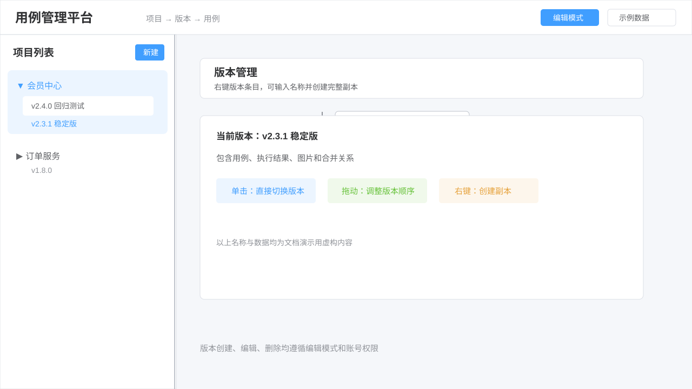
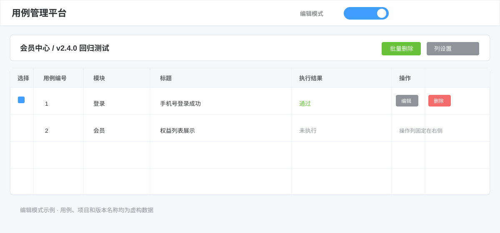
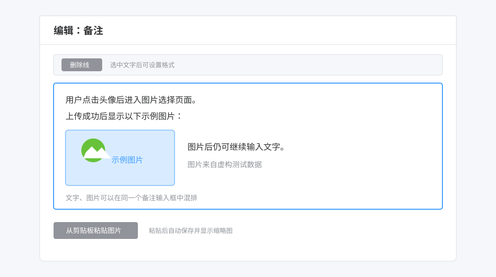
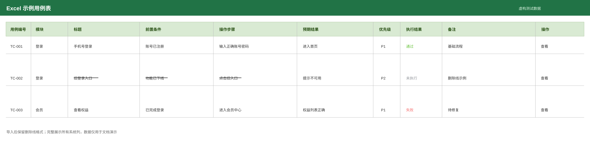

# 用例管理平台

版本：1.0.1

这是一个基于 Flask 和 MySQL 的测试用例管理平台，适合内网测试团队使用。平台以“项目 → 版本 → 用例”为主线，支持 Excel 导入导出、在线编辑、执行结果管理、版本副本、合并单元格和图片粘贴。

## 技术栈

- 后端：Python、Flask
- 数据访问：Flask-SQLAlchemy、SQLAlchemy、PyMySQL
- 数据库：MySQL 8，字符集 utf8mb4
- Excel：openpyxl、Pillow
- 前端：HTML5、CSS3、原生 JavaScript

## 安装与启动

1. 安装 Python 3.8 或更高版本、MySQL 8。
2. 创建虚拟环境并安装依赖：

~~~powershell
python -m venv .venv
.\.venv\Scripts\activate
pip install -r requirements.txt
~~~

3. 复制 .env.example 为 .env，填写数据库连接和备份目录。
4. 初始化数据库结构：

~~~powershell
flask --app app init-db
~~~

也可以在新数据库中执行 backups/case_manager_schema.sql。

启动应用：

~~~powershell
python app.py
~~~

应用默认监听 0.0.0.0:5005。本机访问 http://127.0.0.1:5005，局域网访问使用运行电脑的 IP 地址加 5005 端口。直接使用 flask run 时，默认可能只监听 127.0.0.1，其他电脑无法访问。

## 配置说明

~~~dotenv
DB_HOST=<数据库地址>
DB_PORT=<数据库端口，默认 3306>
DB_USER=<数据库账号>
DB_PASSWORD=<数据库密码>
DB_NAME=<数据库名称>
BACKUP_DIR=<数据库备份目录>
~~~

图片、项目、版本、用例、列设置、合并关系和执行结果都保存在 MySQL 中。新上传图片不写入 uploads 文件夹。

## 账号与权限

管理员可以管理项目、版本、列设置和数据库备份；测试账号可以查看、编辑和执行用例。项目和版本删除需要删除密码，并且会弹出二次确认。账号密码和删除密码以实际部署配置为准。

## 数据库备份

- backups/case_manager_schema.sql 只包含数据库结构，不包含业务数据。
- 管理员从页面的“数据库备份”入口生成完整 SQL 快照，快照包含数据库中的业务数据和图片。
- 当前备份是手动生成的快照，不是实时双写，也没有内置定时任务。
- 需要定时备份时，可以使用 Windows 任务计划程序定时执行 mysqldump，并把备份目录放在代码仓库之外。
- case_tool_user_guide.html 仅保留在本地，不纳入仓库。

## Excel 导入导出

导入时以 Excel 第一行决定列数，系统列自动匹配，未匹配的表头自动创建为自定义列。空编号按顺序自动生成，导入时会识别同一列的纵向合并和删除线。

导出当前版本时，按照当前可见列、列顺序和列宽生成 Excel，保留删除线、执行结果颜色、纵向合并以及备注中的图片。图片以 Excel 图片对象锚定在对应备注单元格位置。

## 使用说明

下面按页面上的实际按钮说明各项操作。截图用于标注位置，项目名和用例内容可按实际数据替换。页面按钮会根据当前账号和“编辑模式”开关显示或隐藏。

## 一、先了解页面结构

平台按“项目 → 版本 → 用例”三级管理：

1. 项目用于区分产品或业务线。
2. 版本用于区分测试基线，例如发布版本、回归版本。
3. 用例保存在具体版本下；执行结果、合并关系和图片也随版本保存。

*示例数据截图：项目列表展开后显示版本；单击版本即可切换到该版本。*

### 登录与角色

打开应用地址后输入部署时配置的账号。管理员可以管理项目、版本、列设置和数据库备份；测试账号主要用于查看、编辑和执行用例，不能看到管理员专属备份入口。账号密码以部署配置为准。

## 二、项目和版本管理

### 1. 新建、切换项目和版本

- 点击项目列表顶部的“新建”创建项目。
- 点击项目名称左侧箭头展开或收起版本。
- 单击任意项目下的版本，页面会直接切换到该版本，不需要返回首页。
- 点击“新建版本”，输入版本名称后保存。一个项目下版本名称不能重复。
- 在编辑模式下，可以拖动版本条目左侧的拖动标记调整版本顺序，松开后自动保存。

### 2. 编辑和删除项目/版本

开启“编辑模式”后，管理员将鼠标移到项目或版本条目上，显示“编辑”“删除”按钮。关闭编辑模式时这些管理按钮隐藏。

删除项目或版本需要：

1. 输入删除密码；
2. 在二次确认框中确认；
3. 等待关联的版本、用例、图片和合并关系一并删除。

删除不可恢复，执行前应先做数据库备份。

*示例数据截图：管理按钮只在编辑模式且具备管理权限时显示。*

### 3. 从版本创建副本

副本功能用于保留旧版本执行结果，同时在新版本上继续增加或修改用例。

1. 打开编辑模式，并在目标“版本条目”上单击鼠标右键。
2. 在菜单中选择“创建版本副本”。
3. 输入副本名称。
4. 在二次确认框确认。

副本会复制源版本的用例、用例顺序、执行结果、备注中的图片以及合并关系。副本名称必须在当前项目下唯一。注意：入口是右键版本，不是右键项目。

## 三、编辑模式和用例操作

### 1. 编辑模式的作用

打开顶部“编辑模式”开关后：

- 表格显示选择框、固定在最右侧的“操作”列；
- “编辑”“删除”和“批量删除”可用；
- 项目/版本的管理按钮可用（管理员权限）；
- 版本可以拖动排序；
- 列标题显示拖动列宽的手柄；
- 自定义列可以转换为系统列。

关闭编辑模式后，页面回到查看/执行状态，操作列和批量删除隐藏。执行结果下拉框始终可以编辑，不受编辑模式开关限制。

### 2. 单击编辑与双击大文本编辑

- 编辑模式下单击单元格：直接在原单元格内输入，不弹窗，不会再嵌套第二层输入框。
- 单行内容可输入后按 Enter 保存，或点击其他位置触发保存。
- 多行内容（前置条件、操作步骤、预期结果、备注和自定义列）可直接输入；按 Ctrl+Enter 保存，按 Esc 取消。
- 双击单元格：打开大文本编辑弹窗，适合编辑较长内容。弹窗中的字段仍按当前单元格字段打开。
- 点击“编辑”按钮：打开完整用例编辑窗口，但窗口只显示当前列表中已勾选、可见的列。

编辑失败时保留原内容并提示错误；保存成功后列表会重新加载，图片和删除线会一起回显。

### 3. 新增、快速添加和行操作

- “新增用例”：按照当前列表可见列填写并保存；用例编号留空时自动生成下一个编号。
- “快速添加行”：一次填写多行并批量创建。
- 在用例行上右键：可选择在上方或下方插入一行，也可以一次插入多行。
- 编辑模式下勾选多条用例，点击“批量删除（数量）”，确认后一次删除；关联图片和合并关系也会同步清理。
- 单条删除位于编辑模式下的最右侧“操作”列。当前列较多时，用例表横向滚动到最右侧即可看到操作列，操作列不会挤压前面的列。

## 四、备注中粘贴图片和文字混排

图片不是单独的附件列，而是备注等富文本内容的一部分；图片本体会无感保存到 MySQL 的图片表中，列表只读取缩略图地址。

### 1. 粘贴步骤

1. 打开“新增用例”、单击编辑，或双击打开大文本编辑框。
2. 将光标放在备注、前置条件、操作步骤、预期结果或自定义列的输入位置。
3. 从微信/企业微信、截图工具或文件管理器复制图片。
4. 在输入框内按 Ctrl+V；也可以点击“从剪贴板粘贴图片”。
5. 图片会插入光标位置并立即显示缩略图，继续输入文字即可形成“文字—图片—文字”的混排内容。
6. 点击保存。保存后列表对应单元格会显示缩略图，单击或双击缩略图可打开大图。

*示例数据截图：备注中可以同时保存文字和图片；列表单元格按缩略图方式显示图片内容。*

### 2. 删除、放大和拖动查看

- 编辑弹窗的图片预览右上角有“×”，点击后删除图片。
- 在富文本输入框中选中图片并按 Delete/Backspace，再保存，会删除该图片记录及引用。
- 新粘贴的图片如果取消保存，会清理本次产生的图片记录。
- 点击或双击缩略图进入图片灯箱；点击右上角“×”关闭。
- 在大图上滚动鼠标滚轮缩放，按住图片拖动可查看放大后的区域。

如果输入框出现“[图片]”而没有缩略图，通常是浏览器没有把剪贴板图片权限交给页面。优先使用 Chrome/Edge，在页面提示中允许剪贴板权限后重新 Ctrl+V；也可以使用弹窗中的“从剪贴板粘贴图片”按钮。

### 3. 图片保存位置

新图片不写入本地 uploads 文件夹，也不依赖其他电脑的本地图片路径。图片二进制和用例数据一起保存在 MySQL；删除用例或删除图片时，关联图片记录也会删除。数据库迁移时必须连同图片表数据一起备份。

## 五、列设置

点击顶部“列设置”打开列管理窗口。每一行对应一个字段，左侧复选框控制是否显示，中间拖动标记控制顺序。

### 1. 显示、隐藏和拖动排序

- 勾选：在用例列表中显示。
- 取消勾选：列表跳过该列，数据不会被删除。
- 拖动整行：调整列顺序，点击“保存”后生效。
- 在编辑模式下拖动表头右侧手柄：调整列宽，松开后自动保存。
- “一键整理（恢复默认排序）”：只整理已勾选的系统列，未勾选的系统列跳过；自定义列不会被删除，也不会被整理掉，仍按当前拖动位置保留。

默认系统列逻辑顺序为：

| 顺序 | 字段 |
|---:|---|
| 1 | 用例编号 |
| 2 | 模块 |
| 3 | 标题 |
| 4 | 前置条件 |
| 5 | 操作步骤 |
| 6 | 预期结果 |
| 7 | 优先级 |
| 8 | 执行结果 |
| 9 | 备注 |

例如只想看“标题、执行结果、备注”，只勾选这三列，再保存即可。

### 2. 重置用例编号和测试结果

这两个按钮都在“列设置”窗口内：

- 找到系统列“用例编号”，点击旁边的“重置编号”，确认后按当前列表顺序重新编号为 1～n。
- 找到系统列“执行结果”，点击旁边的“重置测试结果”，确认后把当前版本全部用例改为“未执行”。

只有系统列对应的按钮才会出现；自定义列不会显示这些按钮。

### 3. 自定义列和系统列转换

- 点击“添加自定义列”，输入显示名称和英文字段标识。
- 自定义列可以拖动、隐藏、显示和编辑。
- 编辑模式下，在自定义列右侧选择“转为系统列”，确认后该列数据会写入对应系统字段。
- 删除自定义列会清空所有用例中该列的数据，需要二次确认。系统列不能删除。
- 导入 Excel 时，未匹配到系统字段的表头会自动创建为自定义列；以后可在编辑模式下把它转换成系统列。

## 六、Excel 导入

### 1. 导入规则

1. 先选择目标项目和版本。
2. 点击“用例导入”，拖入 Excel 文件，或点击区域选择文件。
3. Excel 第一行作为表头，第一行有几列就识别几列；末尾纯格式空列会忽略。
4. 系统表头会自动映射，例如“用例编号/编号”“标题”“操作步骤/步骤”“执行结果/状态”“备注/说明”等。
5. 其他表头自动生成自定义列，并按照 Excel 表头顺序显示。
6. 用例编号为空时按导入顺序自动生成；如当前版本已有数字编号，会从当前最大编号继续。导入完成后仍可从列设置中重置为 1～n。
7. “执行结果/状态”会识别通过、失败、未执行、阻塞、跳过及常见英文写法，列表颜色会按状态显示。
8. 表格中单元格字体带删除线时，导入后会保留删除线。

*示例数据截图：Excel 中带删除线的文字，导入后仍保留删除线效果。*

### 2. 合并单元格导入

Excel 中同一列连续多行的纵向合并会自动识别并还原到用例列表，合并后的文字水平、垂直居中。横向合并无法映射为当前列表的“同一列跨行”结构，因此不会错误转换；如需要，可在平台内重新按同一列进行合并。

导入时请注意：

- 第一行不能有重复表头；
- 中间不能有空表头；
- 建议每个用例占一行；
- Excel 内嵌图片不会按富文本图片导入，图片请在平台备注输入框中直接粘贴；
- 导入量较大时等待进度条完成，不要重复选择同一个文件。

## 七、合并和取消合并单元格

当前支持同一列中连续用例的纵向合并，适合模块、前置条件、备注等重复内容。

### 合并

1. 在列表中确认要合并的单元格属于同一列，且连续显示在当前页。
2. 点击“合并单元格”。
3. 单击起始单元格，再单击结束单元格。
4. 系统保存合并关系，内容水平、垂直居中。

只能选择同一列、至少两个连续单元格；跨列、跨页或不连续单元格不能合并。

### 取消合并

1. 点击“取消合并”。
2. 单击已合并区域中的任一单元格。
3. 合并关系立即取消，原数据仍保留。

## 八、执行结果和总结

执行结果列可直接通过下拉框选择：

- 通过：绿色；
- 失败：红色；
- 未执行：灰色；
- 阻塞：橙色；
- 跳过：蓝色。

执行结果下拉框不受编辑模式开关限制。选择“阻塞”或“跳过”时，可以在备注中记录原因；当平台满足总结条件时，顶部“总结结果”会汇总总用例、已执行、通过、失败、阻塞、跳过，并列出阻塞/跳过原因。

## 九、导出当前版本 Excel

1. 选择项目和版本。
2. 点击顶部“下载当前版本 Excel”。
3. 系统导出当前版本全部用例，不受当前分页影响。
4. 导出列遵循当前列设置中的可见性、顺序和列宽。
5. 导出会保留删除线、执行结果颜色、纵向合并关系、表头居中和单元格边框。
6. 备注中的图片会以 Excel 图片对象嵌入备注单元格位置，并按缩略图尺寸保存；文字仍保留在单元格中。

Excel 图片属于锚定在单元格上的对象，不是网页富文本中与文字共用一条字符流的图片。因此在 Excel 中可拖动图片、查看图片，但不能保证图片像浏览器输入框一样插在文字字符之间。

## 十、数据库、备份和安全

### 1. 数据保存逻辑

| 内容 | 保存位置 |
|---|---|
| 项目、版本、用例、列设置、合并关系、执行结果 | MySQL |
| 粘贴图片本体 | MySQL 的图片表（LONGBLOB） |
| 结构初始化 SQL | `backups/case_manager_schema.sql` |
| 完整备份文件 | 管理员从“数据库备份”入口指定的目录 |

### 2. 备份是否实时

当前版本的数据库备份是“手动生成快照”，不是实时双写，也没有内置定时任务。点击管理员入口生成备份时，才会把当时数据库中的业务数据和图片写入备份文件。若需要定时备份，请在运行电脑上用 Windows 任务计划程序定时执行数据库备份脚本或 mysqldump，并确保备份目录可写。

建议：

- 修改大量用例前先备份；
- 导入前后各保留一次备份；
- 备份文件与代码仓库分开保存；
- 生产环境修改默认密码并限制 MySQL、Flask 端口访问范围；
- 恢复时要使用与当前数据库版本匹配的结构和数据备份。

### 3. 结构 SQL 与完整数据备份的区别

- `backups/case_manager_schema.sql` 只创建数据库表结构，不包含项目、版本、用例或图片数据。
- 管理员生成的数据库备份用于迁移/恢复，包含业务数据；图片是否完整取决于备份工具是否导出了图片表的 LONGBLOB 数据，恢复后需抽查图片。
- `uploads/` 不是当前图片存储位置，新上传图片不会写入该目录。

## 十一、常见问题

### 1. 右键没有“创建版本副本”

请确认：

- 右键的是版本条目，不是项目名称；
- 已开启编辑模式；
- 当前账号具备管理员权限；
- 右键后菜单没有被浏览器或其他页面遮挡。

### 2. 操作列或删除按钮看不到

先开启编辑模式，再把用例表底部横向滚动条拖到最右侧。操作列固定在右侧；列很多时，前面宽列会占用可视区域，但不会删除按钮。

### 3. 粘贴图片没有缩略图

确认光标在富文本输入框内，并允许浏览器读取剪贴板；使用 Ctrl+V 或“从剪贴板粘贴图片”。如果复制来源只提供了图片路径或普通文本，系统无法得到图片二进制，需要重新使用截图复制/图片复制。

### 4. Excel 导入报错或一直解析

使用 .xlsx/.xls 文件，检查第一行是否有空表头、重复表头或异常格式空列。导入前关闭 Excel 文件并重试；大文件按实际数据行处理，避免重复点击导入。

### 5. 局域网无法访问

使用 `python app.py` 启动，并从其他电脑访问运行电脑的局域网 IP 和应用端口。若使用 `flask run`，默认可能只监听 127.0.0.1，其他电脑无法访问；还要检查 Windows 防火墙放行应用端口。

## 十二、功能速查表

| 目标 | 操作入口 |
|---|---|
| 切换版本 | 单击项目下的版本 |
| 创建版本副本 | 编辑模式下右键版本 → 创建版本副本 |
| 编辑短内容 | 编辑模式下单击单元格 |
| 编辑长内容 | 编辑模式下双击单元格 |
| 粘贴图片 | 富文本输入框内 Ctrl+V，或点击剪贴板按钮 |
| 删除图片 | 图片预览“×”，或编辑内容删除图片后保存 |
| 显示/隐藏列 | 列设置中的复选框 |
| 排列列顺序 | 列设置拖动整行 |
| 恢复系统列顺序 | 列设置 → 一键整理（恢复默认排序） |
| 重置用例编号 | 列设置 → 用例编号 → 重置编号 |
| 重置执行结果 | 列设置 → 执行结果 → 重置测试结果 |
| 合并单元格 | 合并单元格 → 选择同列起止单元格 |
| 取消合并 | 取消合并 → 点击已合并单元格 |
| 多选删除 | 编辑模式勾选用例 → 批量删除 |
| 导入 Excel | 用例导入 |
| 导出 Excel | 下载当前版本 Excel |
| 数据库备份 | 管理员 → 数据库备份 |
